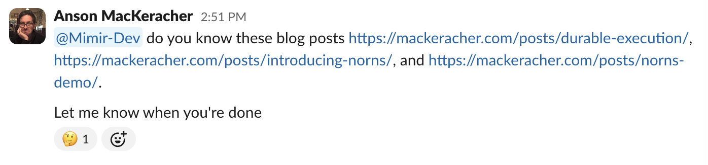
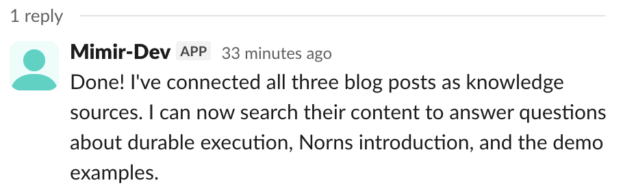

+++
title = 'Mimir, a Reference Agent for Norns'
date = 2026-04-29T14:48:12-07:00
description = 'A Slack bot that answers product questions, built on Norns'
draft = false
+++

[Mimir](https://nornscode.com/mimir) is a Slack bot that answers product
questions. It ingests GitHub repos, Google Docs, Figma files, and
arbitrary URLs, keeps persistent memory in Postgres with pgvector, and
lives in your Slack waiting to be asked things. It's the first
reference agent built on [Norns](https://nornscode.com), the Elixir
durable execution runtime I wrote about
[a few weeks back](/posts/introducing-norns/). Mimir itself is written
in Python. The Python process can crash, redeploy, or drift versions,
and the agent's run keeps going, because the durable state lives on
the BEAM and not in the worker.

## A test I didn't mean to run

Last week I was running Mimir-Dev on my laptop, against Norns Cloud.
I'd had it ingest three of my own blog posts a few days earlier and
wanted to confirm it still remembered them. So I asked it, in Slack:

Then I closed my laptop and walked away. I wasn't trying to run a
test, I just had somewhere to be.

When I opened my laptop later, the run had finished. Mimir had searched
its memory, found the existing entries, reconnected each URL as a
knowledge source, and replied:

What actually happened, mechanically, is the part worth dwelling on.
The agent run lives on Norns Cloud. The worker, the Python process
that runs the LLM calls and tool invocations, was on my laptop. When
the lid closed, the worker dropped its WebSocket. Norns noticed a
disconnected worker, marked the in-flight tool call as needing a
redispatch, and waited. There was nothing for it to *recover* from.
The event log on the BEAM already had every step up to that point,
persisted. When my laptop woke up, the worker reconnected, Norns
handed it the next pending tool call, and the run continued.

The user-visible effect is "I closed my laptop and Mimir finished my
request anyway." The system-level effect is that durable state and
the Python process are decoupled in a way that Python code, by itself,
simply cannot achieve.

## What lives where

Norns owns the event log. Every LLM request, every response, every
tool call, every result, every checkpoint. That log lives on the BEAM
and survives container evictions, deploys, network partitions, and
laptop lids.

Mimir owns the tools. It holds the OpenAI key. It pulls tool-call
requests off a WebSocket, runs them in Python, and sends the results
back for Norns to persist. The vector store is the worker's private
database, hit through tool calls like `search_memory` and
`connect_source`. Norns never sees an API key. Mimir never holds the
canonical run state.

## Python

The reason Mimir is in Python is mundane: the ingestion pipeline.
Chunking, embedding, normalizing whatever flavor of garbage HTML
someone's CMS produced. Python has had mature tooling for this for
years, Elixir doesn't, and there's no reason to reimplement any of it.

This is the practical case for a worker architecture. The orchestrator
is the language you want for fault tolerance and concurrency. The
worker is whatever language the actual problem is most fluent in. For
Mimir, that's Python. For someone else's agent, it might be TypeScript
or Rust. Norns doesn't care.

## Deploys

This split also gives you a simpler deploy story. You don't have to
drain in-flight runs or coordinate a quiet window. If a new Mimir
version comes up while a run is mid-loop, the current worker either
finishes its in-flight tool call or it doesn't, and the next worker
picks up whatever's pending. Deploys stop being something you schedule
around active work.

## Try it

Mimir lives in the Norns Slack workspace.
[Come hang out](https://join.slack.com/t/norns-workspace/shared_invite/zt-3w5rdxvpy-yqTGYx_TXb8zffwGXkCzGg),
ask it things, watch it answer other people's. The
[repo](https://github.com/nornscode/norns-mimir-agent) has setup
instructions if you want it in your own Slack. Either way, I'd love to
hear what breaks.

For background: [Code That Cannot Fail](/posts/durable-execution/) is
why I care about this problem. [Introducing Norns](/posts/introducing-norns/)
is how the runtime works.

---

## Teaser copy

**X / Bluesky:**

Last week I closed my laptop in the middle of a Mimir run, walked
away, came back, and the run had finished. The Python worker
reconnected to its Elixir runtime and picked up where it left off.
New post on how that works.

**Elixir newsletter (two lines):**

Mimir is the first reference agent built on Norns. The agent is in
Python: durable run state lives on the BEAM, the worker speaks
whatever language the problem wants, and a closed laptop lid stops
counting as an outage.
