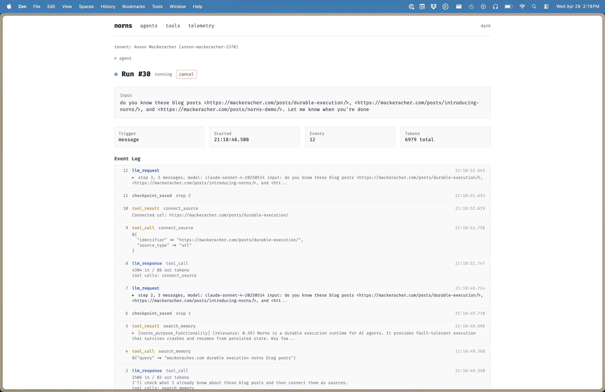

+++
title = 'I Closed My Laptop and Mimir Kept Going'
date = 2026-04-29T14:48:12-07:00
description = 'A Slack bot that answers product questions, built on Norns'
images = ['/posts/introducing-mimir/event-log.png']
draft = false
+++

[Mimir](https://nornscode.com/mimir) is a Slack bot that answers
product questions. It ingests GitHub repos, Google Docs, Figma files,
and arbitrary URLs, and keeps persistent memory in Postgres with
pgvector. It's the first reference agent built on
[Norns](https://nornscode.com), the Elixir durable execution runtime
I wrote about [a few weeks back](/posts/introducing-norns/). Mimir
itself is written in Python. Even when the worker gets stopped and
restarted, the run continues, because the durable state lives in
Norns, not in the worker.

## The test I didn't mean to run

Last week I was running Mimir-Dev (the dev instance) on my laptop,
against Norns Cloud. I'd had it ingest three of my own blog posts a
few days earlier and wanted to confirm it still remembered them. So
I asked it in Slack:

Then I closed my laptop. I was boarding a ferry from Bowen Island
to Vancouver. I wasn't trying to run a test.

When I opened my laptop later on the sailing, the worker
reconnected and the run finished. Mimir had searched its memory,
found the existing entries, reconnected each URL as a knowledge
source, and replied:

Here's what actually happened. The agent _run_ lives on _Norns
Cloud_. The _worker_, the Python process that executes LLM calls and
tool invocations, was on my laptop. When the lid closed, the
_worker_ dropped its WebSocket. Norns noticed, marked the in-flight
tool call as needing a redispatch, and waited. There was nothing to
*recover* from. The event log on the BEAM had already persisted
every step up to that point. When my laptop woke up, the _worker_
reconnected, Norns handed it the next pending _tool call_, and the
run finished. I closed my laptop and Mimir finished my request
anyway.

## What lives where

Norns owns the event log: every LLM request and response, tool
call, result, and checkpoint. The log lives on the BEAM, where it
survives container evictions, deploys, network partitions, and
laptop sleeps.

Mimir owns the tools and holds the OpenAI key. It pulls tool-call
requests off a WebSocket, runs them in Python, and sends the results
back for Norns to persist. The vector store is the worker's private
database, hit through tool calls like `search_memory` and
`connect_source`. Norns never sees an API key. Mimir never holds
the canonical run state.

## Python

Why Python? The ingestion pipeline. Chunking, embedding,
normalizing whatever flavor of garbage HTML someone's CMS produced.
Python has mature tooling for this. Elixir doesn't. No point
reimplementing the wheel.

This is the whole point of a worker architecture. The orchestrator
is the language you want for fault tolerance and concurrency. The
worker is whatever language the problem calls for. For Mimir, that's
Python. For someone else's agent, it might be TypeScript or Rust.
Norns doesn't care.

## Deploys

This split also makes deploys simpler. You don't have to drain
in-flight runs or coordinate a quiet window. If a new Mimir version
comes up while a run is mid-loop, the current worker either finishes
its in-flight tool call or it doesn't. The next worker picks up
whatever's pending. Deploys stop being something you schedule around
active work.

## Try it

Mimir lives in the Norns Slack workspace.
[Come hang out](https://join.slack.com/t/norns-workspace/shared_invite/zt-3w5rdxvpy-yqTGYx_TXb8zffwGXkCzGg),
ask it things, watch it respond to others. The
[repo](https://github.com/nornscode/norns-mimir-agent) has setup
instructions if you want it in your own Slack.

A reference agent is a worked example. You read it when you're
deciding whether the runtime can hold up under your own agent. What
I want to see is people pointing Norns at agents that look nothing
like Mimir and telling me what cracks.
