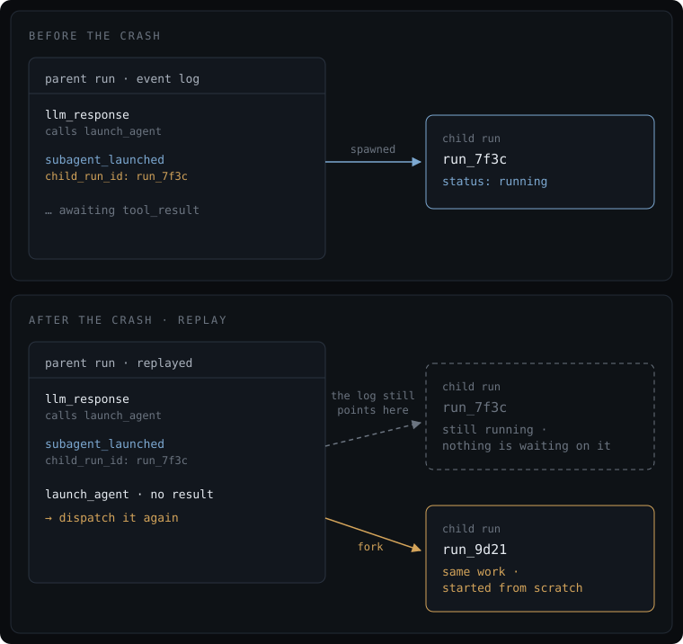

+++
title = 'Is This Still Happening?'
date = 2026-08-08T09:00:00-07:00
description = "Norns' crash recovery re-dispatched pending sub-agent launches, forking the work instead of retrying it. Three bugs, one mistake."
draft = false
+++

[Norns](https://github.com/nornscode/norns) is a durable agent
runtime. If the process dies mid-run, the run survives. Every LLM
call, tool call, and tool result is an event in Postgres, and recovery
means replaying that log. The rule for in-flight work is simple:

> Replay to the last checkpoint. Replay forward. Any tool call with no
> matching result gets dispatched again.

That rule works fine for every tool a worker executes. It turns out
there's one tool it gets badly wrong.

## A pending call isn't always a request

Most tool calls are requests: if the agent crashes, just resubmit the
request. `search_docs()` has no results yet? Just ask again. Worst
case, you just run the query twice.

`launch_agent` is different. An agent uses it to delegate. It names
another agent, hands it a message, and parks until the child comes
back. A pending `launch_agent` is not a request. It's a reference to
work already underway. The child run exists, has an id, and is burning
tokens right now in another process. Re-dispatching it doesn't retry
anything. It forks.

So a parent that crashed while awaiting a sub-agent came back up, saw
a `launch_agent` with no result, and started a second child from
scratch. The original kept running with nothing waiting on it. You
paid for the child twice, and the audit trail lied about which run
produced the answer.

## "Did this happen?" is the easy question

Norns already has [idempotency machinery](/posts/introducing-norns/).
Side-effecting tools get a deterministic key, and on replay the
executor checks the event log for a result with that key before
running the tool again.

But that machinery makes sure things execute at most once. It answers
"did this already finish?", and a pending `launch_agent` hasn't
finished. It's still running. There's no result to find.

The question that actually matters for long-running work is "is this
still happening, and can I get back to it?"

The log already had the answer. The `subagent_launched` event recorded
the child's run id, so on resume the parent now looks the child up
instead of relaunching it. Child finished? Read its result. Still
running? Wait for it. Gone completely? Return an error instead of
quietly starting the bill over.

## Subscribe before you look

Waiting on an in-flight child has an obvious race. The parent reads
the status, sees "running", and subscribes, but the child finished in
between and its broadcast went to nobody. The standard shape is to
subscribe first, then read. Resolution is a `Map.pop` on the pending
map, so the broadcast and the status read can both fire and the
second one finds nothing. Once resolution is idempotent, ordering
stops mattering.

On boot, Norns resumes any run with no live process, so a whole-node
crash heals parent and child both. But a parent resumed alone would
wait forever on a child nobody restarted. The parent now resumes its
own child if nobody else has. Delegation
makes you responsible for what you delegated to, including bringing it
back from the dead.

## Two more bugs, same shape

Fixing the fork turned up two more bugs in the same code path.

Replay dispatched the launch twice. Under the default checkpoint
policy the launch call survives replay on its own, but the replay
handler was written for `:every_step`, where it doesn't, so it
appended a synthetic copy anyway and dispatched both. Nobody had
tested the two checkpoint policies against every crash point. The synthetic copy also
dropped the original message, so the relaunch ran with an empty
prompt.

Concurrent launches collided. The pending map was keyed by child
*agent* id, so launching the same agent twice in one step (a perfectly
reasonable thing for a model to do) overwrote the first entry, and one
call never got a result.

All three bugs come from confusing a thing with the kind of thing it
is. An agent is a definition. A run is one execution of it. The
pending record, the tracking map, and the completion broadcast all
needed to name the run. Now they do.

## Why now

None of this came from a bug report. I found it while designing an
agent whose job is to build, run, and evaluate other agents. That
agent would call `launch_agent` constantly, turning delegation into
the hot path. A failure mode that's rare when one run in a thousand
delegates becomes routine when every run does.

Seven new tests confirm the bugs and the fixes. They also caught a
bug in the fix itself. A child broadcasts `:agent_resumed` when it
comes back up, and since no parent had ever been the one resuming a
child before, the parent had no handler for that message and crashed
in the middle of its own recovery. Everything above is
[one commit](https://github.com/nornscode/norns/commit/3c777377466af0cbb07cdb2b60b0b81a792ebdb4),
and it shipped in
[Norns v0.4](https://github.com/nornscode/norns/releases/tag/v0.4)
alongside run lineage, depth limits, and sub-agent authorization. That
trio is the rest of the groundwork for agents that launch agents.

Depth limits bound recursion, but they say nothing about fan-out. One
agent launching fifty children at depth 1 costs far more than a chain
of five. A spend ceiling is a different mechanism, and I haven't built
it yet.

There's a general lesson here about durable systems. All the machinery
I'd built answers questions about the past. Did the email send? If
not, send it again. Delegation breaks that frame, because the work is
running somewhere else and doesn't stop existing when you crash.
Recovery isn't just replaying what finished. It's finding your way
back to what's still happening.
