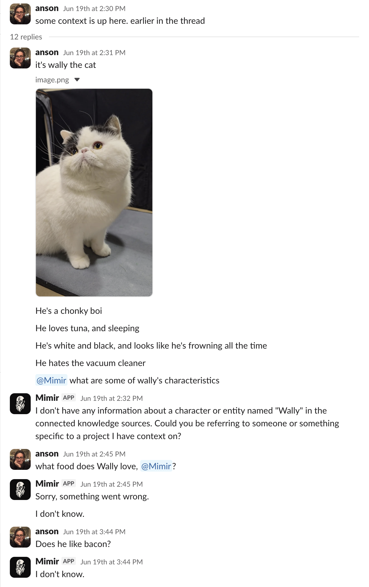
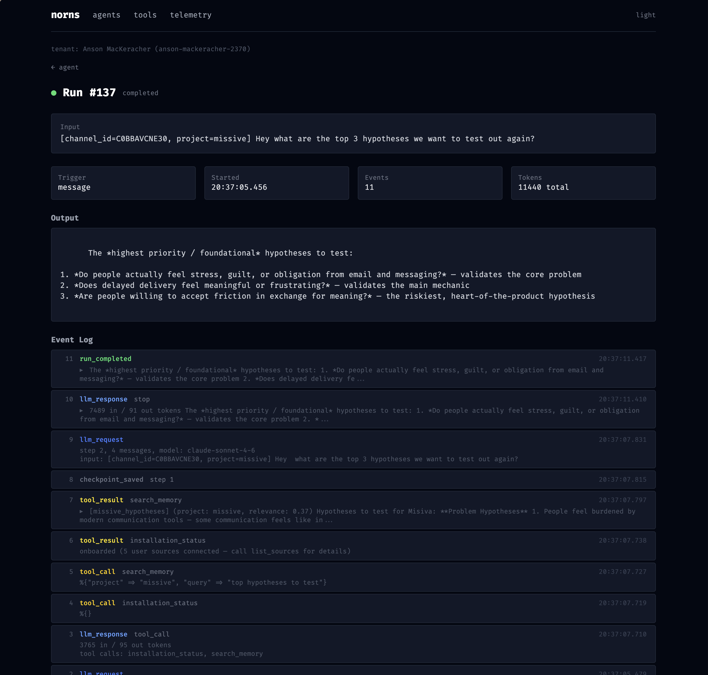

+++
title = 'Norns v0.3'
date = 2026-07-03T09:30:00-07:00
description = 'Sub-agent context inheritance, and three bugs found by running Mimir in production'
images = ['/posts/norns-v0.3/norns-v0.3-og.png']
draft = false
+++

[Norns v0.3](https://github.com/nornscode/norns/releases/tag/v0.3) is
out. The biggest new feature is sub-agent context inheritance, but the
part I want to write about is the bug fixes. All three came from
running [Mimir](/posts/introducing-mimir/) in production.

## Three bugs from production

### Stale agent config

I repointed Mimir at a new model after its old snapshot was
decommissioned, but runs kept dispatching against the retired snapshot
anyway.

Each agent is a long-lived `GenServer`. It read its definition
(model, system prompt, tools) once at init and held onto it forever. Updating the agent over the REST API wrote to the
database, but nothing read the database again. The fix is to re-read
the agent record before every LLM dispatch, so an update takes effect
on the next step.

This is a general lesson about long-lived processes, anything that
loads config once at startup needs an invalidation story. 
Downstream, Mimir had been monkey-patching a
private SDK method in two places just to route around this. That
patch can be deleted now! Yay.

### The sliding window split tool calls

Long tool-heavy conversations started getting rejected by Anthropic:

```
Each `tool_result` block must have a corresponding `tool_use`
block in the previous message.
```

The sliding-window context strategy trimmed history by raw message
count, with no idea that a `tool_use` and its `tool_result` are an
atomic pair. Each tool call costs two messages, so agents making
several calls per turn landed the window boundary mid-pair often. The
fix walks the boundary back until it starts on an assistant message
instead of a tool message. The old workaround was raising the window
from 20 to 50, which doesn't fix anything, it just delays it.

### An empty final turn discarded the real answer

A user asked Mimir a question. It browsed a repo, wrote a detailed
answer, and called its `remember` tool in the same turn. Then its
next turn came back empty, and the run's output was an empty string.
The answer existed one turn back in the message history. The user got
"something went wrong."



The runtime took whatever text was on the terminal turn, full stop.
Now, if the final turn is blank, it walks backward and uses the last
assistant message with real content. Every agent on the runtime gets
this for free, instead of every system prompt having to say "always
restate your final answer."

## Context inheritance

A parent agent can now pass context to a child when it spawns one.
Before this, a sub-agent started with a blank slate. If the parent
had already gathered useful state, like a ticket ID or a slice of
conversation, the only way to share it was cramming everything into
the spawn message by hand.

Now there are two channels: `context.messages` seeds a slice of
message history as the child's initial messages, and `context.data`
injects structured state as a tagged context message. Both the
`launch_agent` tool call and the SDK path go through the same server
primitive, so the behaviour is identical either way.

The important part is that the handoff is durable. Context is
persisted in the run's input, so it survives a crash and resume. It's
also recorded on the spawn event, so you can look at the event log
and see exactly what a parent handed to a child. This is the point of
Norns: agents that spawn and resume other agents durably, not just an
LLM in a loop.

## Also in v0.3

There's a telemetry dashboard at `/telemetry`, and every page has a 
dark mode toggle now.



The [repo](https://github.com/nornscode/norns) is public. If you're
building agents on Norns and hit any bugs or jank,
[open an issue](https://github.com/nornscode/norns/issues)!
