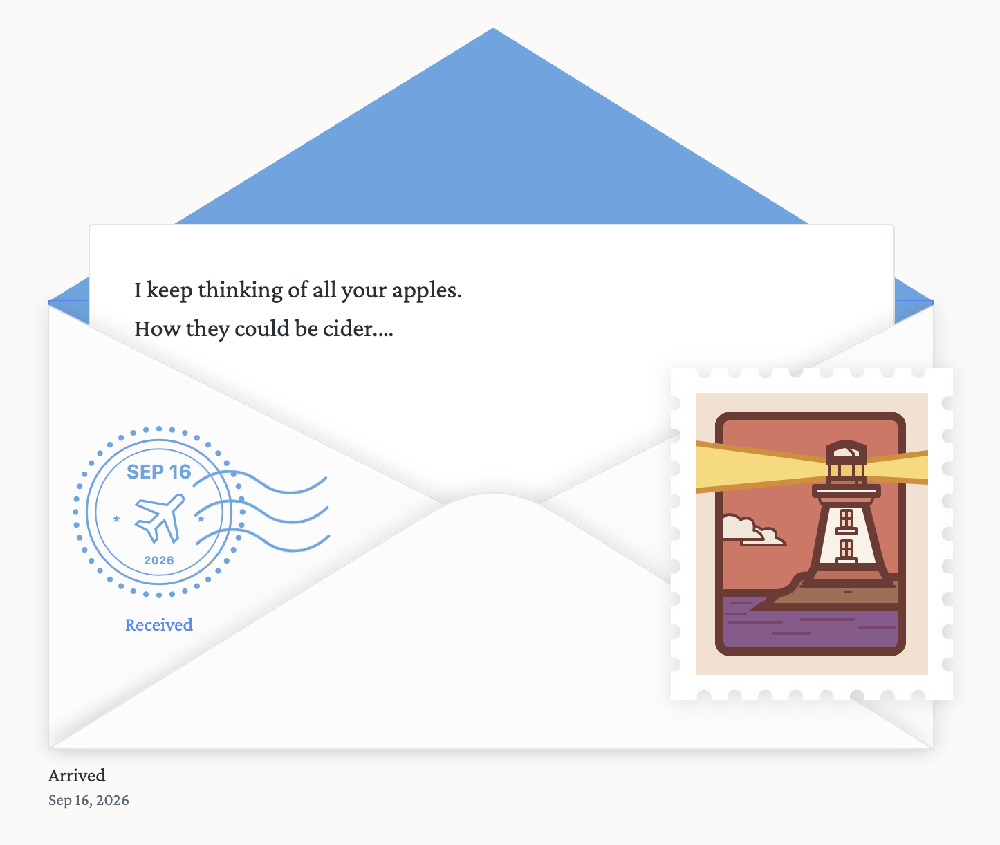
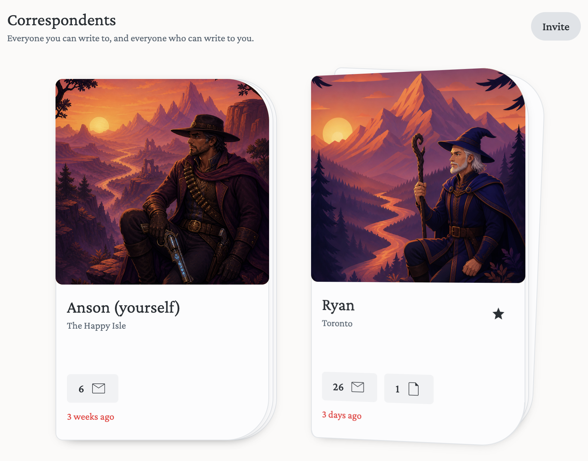
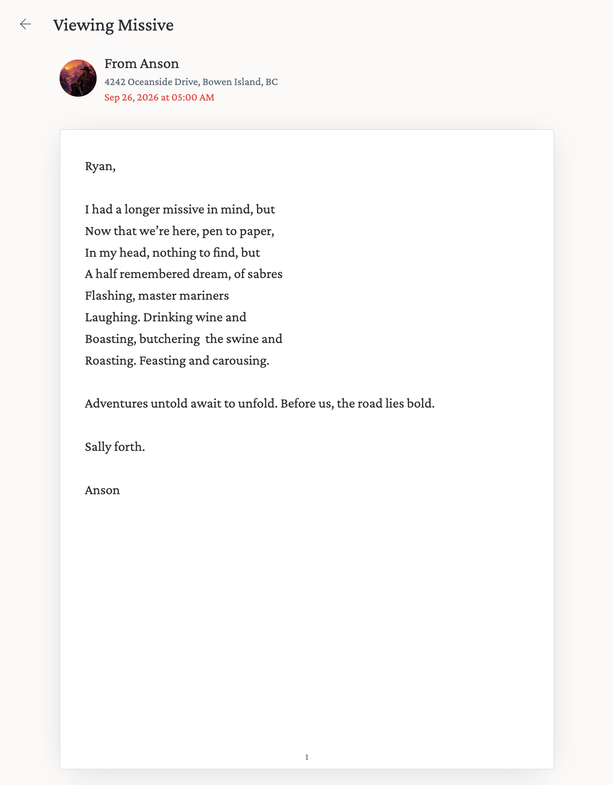

+++
title = 'Slow Mail'
date = 2026-09-28T09:00:00-07:00
draft = false
description = "We've been building Missive, a correspondence app that delivers once a day, like the post. A few friends are testing it."
+++

For a long time now I've checked my personal inbox only a few times a
day. When I slip up and start refreshing it every hour (or more), I
feel worse and get less work done.

Most people don't work this way.
[RescueTime found](https://blog.rescuetime.com/communication-multitasking-switches/)
that people check email or chat about every six minutes. Cal Newport
calls this the [hyperactive hive
mind](https://calnewport.com/on-productivity-and-remote-work/), where
work runs on a steady stream of unscheduled messages, answered as they
come in. It's the opposite of flow, and you can't write anything
thoughtful from inside it.

Work is its own thing, and it's fine to keep it separate. I'm being
paid to plug into the hive mind and push the project forward. On the
personal side, I'd rather be in the realm of thoughtful, deliberate
discourse when I can manage it. When I write to a friend, I don't
want to be one more notification in their way.

So my friend [Ryan Snow](https://www.straightlinephobia.com/) and I
have been building a thing called Missive. It's digital mail, but it
works like the analog post office.

When you send a letter it sits in your outbox for an hour. You can
still edit it or not send it at all. After that, it's in transit. You
can decide if a missive gets delivered the next day, or next week.
Everybody's mailbox gets updated once per day, at a time of their
choosing. There's a map that shows missives in transit, so you know
something is on its way, but you can't read it until it lands.

That's most of it. A few other rules. Letters are plain text, with one photograph enclosed if you want.
There's no threading, so you reply to a letter by remembering what it
said. Notifications are minimal, you get pinged once when a missive
arrives and that's it. You can only write to someone who has added you
to their correspondents, and signup is invite only, so the address
book stays small and everyone in it is someone you actually know.
Your first letter is from the postmaster, which is me.

One surprise is how differently people write when they know the reply
is at least a day away. Nobody sends a quick "ok", you tend to sit
down and write a page. Ryan and I have traded a couple dozen letters
so far, and the one below came out as a poem, which is not something
either of us does over text.

Writing to someone, knowing it won't arrive until tomorrow at the
earliest, feels different from typing into a chat box. Nobody is
waiting on you, so there's no rush.

A handful of friends have been testing it for a few weeks now and the
feedback has been good. Part of that is that it's more art project
than product. Letters get stamps and postmarks and take their time to
arrive. None of that is necessary, but it's what makes the thing fun
to open.

Under the hood it's a Phoenix backend with an Oban job that ticks
every minute and moves the mail along, and a React frontend. Custom
design system by Ryan.

It's not ready for the public yet. We want to keep it small for a
while and see what a few dozen people do with it. If you're the kind
of person who wants a pen pal in 2026, write me at
[anson@mackeracher.com](mailto:anson@mackeracher.com) and I'll send an
invite when the time comes.
